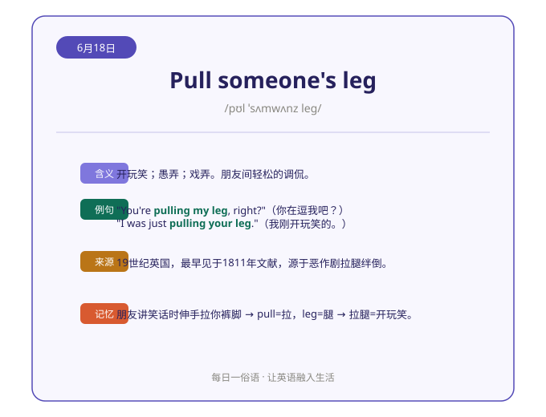
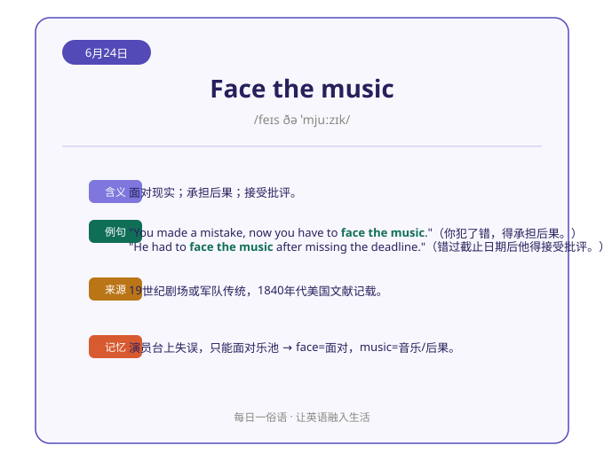

# 每日英语俗语 Daily English Idiom 🗣️

一个**开箱即用的 Skill 模板**：让 AI 每天自动推荐一条实用的英语俗语，输出**可视化 SVG 卡片 + 结构化学习内容**（含义 / 例句 / 来源 / 记忆提示），并自动去重、记录历史。

> 每日一俗语 · 让英语融入生活

---

## ✨ 特性

- 📅 **每日一条**：自动推荐生活中、职场中高频使用的英语俗语
- 🎨 **8 款卡片模板**：手账、便利贴、极光暗夜、横线笔记本等风格任选，改一行配置即可换肤（见 [templates/cards/](templates/cards/)）
- 🧠 **结构化学习内容**：含义、2 条例句、俗语来源、记忆小提示、关键词联想
- 🔄 **自动去重**：基于 `memory.md` 历史记录，绝不重复推荐
- 🛡️ **工程化设计**：内置失败模式编码、异常处理表、反例黑名单（详见 SKILL.md）
- ⚙️ **可接入自动化**：可配置为每日定时任务自动执行

## 🖼️ 效果预览

<p align="center">
  
  
</p>

更多示例见 [examples/](examples/)：

| 示例 | 俗语 | 推送日期 |
|------|------|----------|
| [01](examples/01-pull-someones-leg.md) | Pull someone's leg | 2026-06-18 |
| [02](examples/02-the-squeaky-wheel-gets-the-grease.md) | The squeaky wheel gets the grease | 2026-06-20 |
| [03](examples/03-the-whole-nine-yards.md) | The whole nine yards | 2026-06-21 |
| [04](examples/04-dont-count-your-chickens-before-they-hatch.md) | Don't count your chickens before they hatch | 2026-06-23 |
| [05](examples/05-face-the-music.md) | Face the music | 2026-06-24 |

## 🎴 卡片模板选择

内置 8 款卡片风格，预览见 [templates/cards/README.md](templates/cards/README.md)：

| 编号 | 风格 | 编号 | 风格 |
|---|---|---|---|
| A | 轻改紫卡（默认） | F | 复古报纸 |
| B | 手账风 | G | 便利贴 |
| C | 极简编辑 | I | 极光暗夜 |
| J | 蜜桃盐系 | K | 横线笔记本 |

在 `memory.md` 顶部「配置」区设置即可切换：

```
卡片模板: G        # 换成你想要的编号；设为 ROTATE 则按周轮换
```

## 📦 安装方法

### 方式一：直接把链接丢给 AI Agent（小白最推荐 🌟）

**什么都不用自己操作**，只需把下面这段话复制给你的 AI 助手（WorkBuddy / Codex / Claude 等），让它自己去下载、安装，再教你怎么用：

> 请帮我把这个 GitHub 仓库的 Skill 安装好：
> 仓库：https://github.com/fang-123559/daily-english-idiom
> 请先下载（git clone 或下载 ZIP），把 `daily-english-idiom` 文件夹放到我的 skills 目录
> （WorkBuddy: `~/.workbuddy/skills/`，Codex: `~/.codex/skills/`，Claude: `~/.claude/skills/`），
> 确认 `SKILL.md` 在文件夹根目录，然后告诉我怎么用它。

也可以直接让 Agent 执行下面的命令完成下载：

```bash
git clone https://github.com/fang-123559/daily-english-idiom.git
# 然后按提示把 daily-english-idiom 文件夹复制到你对应平台的 skills 目录
```

### 方式二：手动下载（推荐新手）

1. 点击右上角 **Code → Download ZIP** 下载并解压
2. 将解压后的文件夹放入你的 Skill 目录：
   - **WorkBuddy**：`~/.workbuddy/skills/`
   - **Codex**：`~/.codex/skills/`
   - **Claude**：`~/.claude/skills/`
   - 其他支持 Agent Skills 的平台：放入对应 skills 目录
3. 确保文件夹名为 `daily-english-idiom`，且 `SKILL.md` 在文件夹根目录

### 方式三：Git 克隆

```bash
git clone https://github.com/fang-123559/daily-english-idiom.git
# 然后将整个文件夹复制到 skills 目录
```

## 🚀 使用方式

### 方式一：对话中直接触发

安装完成后，在 AI 对话中输入任意触发词，即可生成今日俗语卡片：

> "每日英语俗语"、"推荐一个英语俗语"、"今天学什么俗语"

### 方式二：接入自动化定时推送（推荐）

在 WorkBuddy / Codex / Claude 等平台创建一个每日定时任务，prompt 可参考 [prompts/automation-prompt.md](prompts/automation-prompt.md)：

```text
每天推荐一条英语俗语，严格按 SKILL.md 的 daily-english-idiom 模板执行：
读取 memory.md 历史记录去重 → 选择新俗语 → 生成 SVG 卡片 + 结构化文字 → 更新历史记录
```

首次使用请复制 [templates/memory-template.md](templates/memory-template.md) 为项目根目录下的 `memory.md`。

## 🗂️ 项目结构

```
daily-english-idiom/
├── SKILL.md                      # Skill 核心定义（执行流程 + 模板选择逻辑 + 异常处理）
├── README.md                     # 本文件
├── LICENSE                       # MIT 许可证
├── prompts/
│   └── automation-prompt.md      # 自动化定时任务的 prompt 模板
├── templates/
│   ├── memory-template.md        # memory.md 模板（含卡片模板配置区）
│   └── cards/                    # 8 款卡片模板（每款 = 生成规范 .md + 预览 .svg）
│       └── README.md             # 模板索引与选择说明
└── examples/                     # 完整输出示例（SVG 卡片 + 结构化文字）
```

## ⚙️ 自定义

- **换卡片风格**：修改 `memory.md` 配置区的 `卡片模板` 字段（A/B/C/F/G/I/J/K/ROTATE）
- **改某款模板配色**：修改 `templates/cards/` 下对应 .md 规范中的色值
- **改推送风格**：调整「结构化文字」部分的模板结构
- **改触发场景**：修改 SKILL.md frontmatter 中的 `description` 触发词

## 📜 License

[MIT](LICENSE) © fang-123559

---

<p align="center"><b>每日一俗语 · 让英语融入生活</b> 🇬🇧</p>
